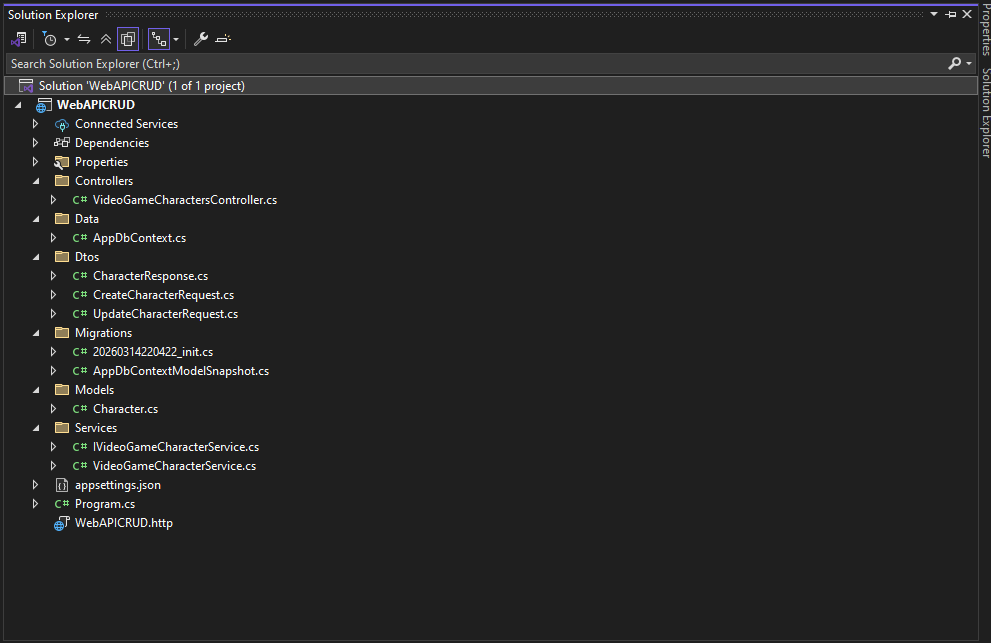
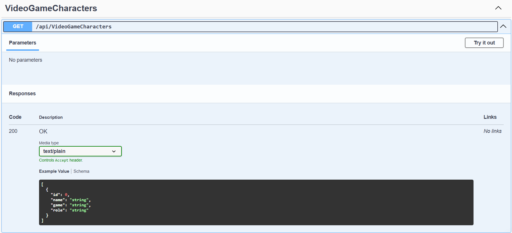
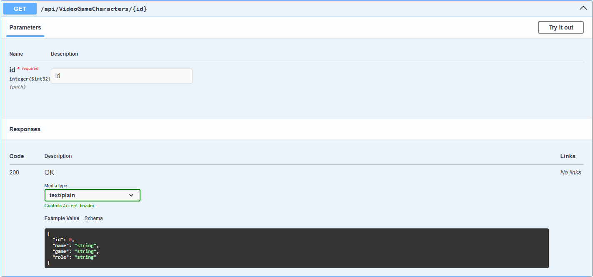
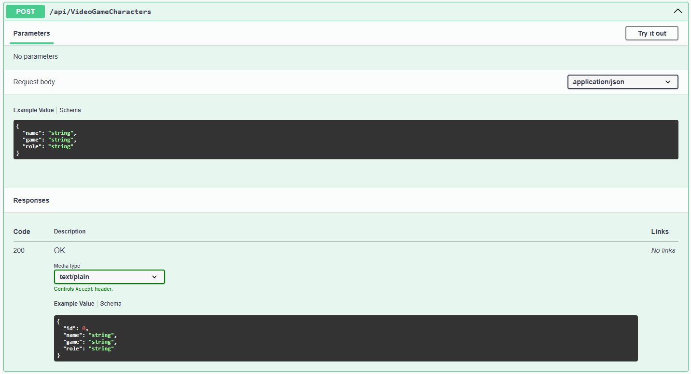
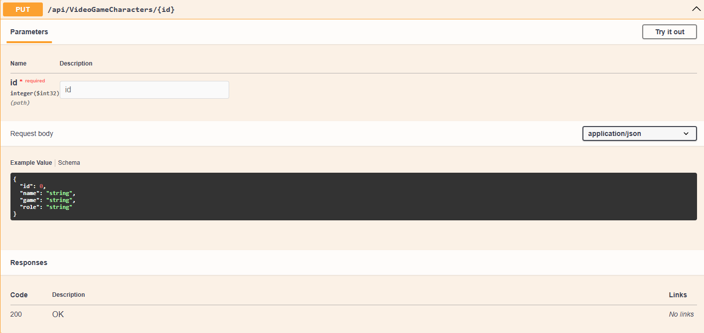
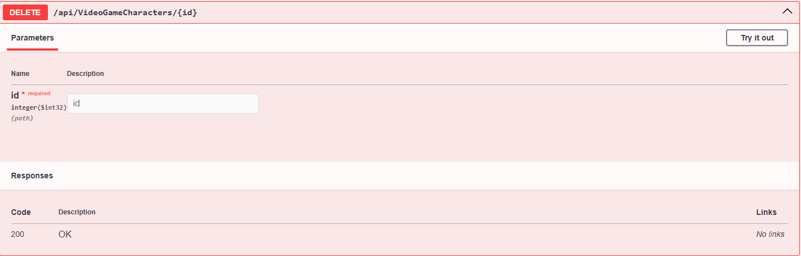

# 🎮 Video Game Character API

A RESTful Web API built with **ASP.NET Core** that allows users to manage video game characters using **CRUD operations**(Create, Read, Update, Delete).

The project follows a **clean architecture approach** using:

* Controllers
* Services
* DTOs
* Database layer using **Entity Framework Core**

Data is stored in **Microsoft SQL Server** and API documentation is available through **Swagger**.

---

# 🚀 Features

* Create new video game characters
* Retrieve all characters
* Retrieve character by ID
* Update character information
* Delete characters
* Clean Service Layer Architecture
* DTO Pattern implementation
* SQL Server database integration
* Swagger API documentation

---

# 🛠️ Technologies Used

| Technology            | Purpose                     |
| --------------------- | --------------------------- |
| ASP.NET Core          | Web API Framework           |
| Entity Framework Core | Database ORM                |
| Microsoft SQL Server  | Database                    |
| Swagger               | API Testing & Documentation |
| C#                    | Programming Language        |

---

# 📂 Project Structure

```
VideoGameCharacterApi
│
├── Controllers
│   └── VideoGameCharactersController.cs
│
├── Models
│   └── Character.cs
│
├── Dtos
│   ├── CharacterResponse.cs
│   ├── CreateCharacterRequest.cs
│   └── UpdateCharacterRequest.cs
│
├── Services
│   ├── IVideoGameCharacterService.cs
│   └── VideoGameCharacterService.cs
│
├── Data
│   └── AppDbContext.cs
│
├── Program.cs
└── appsettings.json
```
# 📂 Screenshot



---
# 🗄️ Database Model

### Character Entity

| Property | Type   |
| -------- | ------ |
| Id       | int    |
| Name     | string |
| Game     | string |
| Role     | string |

---

# 🔌 API Endpoints

Base URL

```
https://localhost:5001/api/VideoGameCharacters
```

---

# 📥 Get All Characters

Retrieve a list of all characters.

### Endpoint

```
GET /api/VideoGameCharacters
```

### Example Response

```json
[
  {
    "id": 1,
    "name": "Kratos",
    "game": "God of War",
    "role": "Warrior"
  }
]
```

# 📥 Screenshot



---

# 🔍 Get Character By Id

Retrieve a single character using its ID.

### Endpoint

```
GET /api/VideoGameCharacters/{id}
```

### Example

```
GET /api/VideoGameCharacters/1
```

# 🔍 Screenshot



---

# ➕ Create Character

Create a new video game character.

### Endpoint

```
POST /api/VideoGameCharacters
```

### Request Body

```json
{
  "name": "Mario",
  "game": "Super Mario",
  "role": "Hero"
}
```

# ➕ Screenshot



---

# ✏️ Update Character

Update an existing character.

### Endpoint

```
PUT /api/VideoGameCharacters/{id}
```

### Request Body

```json
{
  "id": 1,
  "name": "Kratos",
  "game": "God of War",
  "role": "God Slayer"
}
```

# ✏️ Screenshot



---

# ❌ Delete Character

Delete a character using its ID.

### Endpoint

```
DELETE /api/VideoGameCharacters/{id}
```

Example:

```
DELETE /api/VideoGameCharacters/1
```

# ❌ Screenshot



---

# 🗄️ Configure Database

Edit **appsettings.json**

```
"ConnectionStrings": {
 "DefaultConnection": "Data Source=YOUR_SERVER;Initial Catalog=VideoGameCharactersDb;Integrated Security=True;Encrypt=True;TrustServerCertificate=True"
}
```

---

# 🧱 Apply Migrations

Using Package Manager Console

```
Add-Migration InitialCreate
Update-Database
```

Or using CLI

```
dotnet ef migrations add InitialCreate
dotnet ef database update
```

---

# 📑 Swagger Documentation

Once the project runs, open:

```
https://localhost:5001/swagger
```

You can test all endpoints directly from Swagger UI.

---

# 🧠 Architecture Overview

This project follows a **layered architecture**:

### Controller Layer

Handles HTTP requests and responses.

### Service Layer

Contains business logic.

### Data Layer

Handles database operations via Entity Framework Core.

### DTO Layer

Transfers data between the API and the client.

---

# 👨‍💻 Author

Developed by **Abo Alfadel Ramadan**

If you like this project, give it a ⭐ on GitHub.
